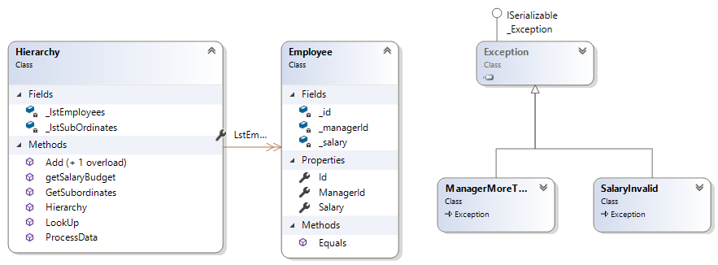

# Question 2
## Scenario
Develop a .NET library assembly (DLL) for a system that handles the employee hierarchy, implemented as class Employees. This class has a constructor that takes a CSV string that contains all the employees from the company, the manager they report to, and the employee’s salary. Develop the library assembly that contains the code for the questions below. Make sure to provide unit tests for your code and an efficient solution.
- a. Create a constructor that takes a CSV1 input string containing a list of employee info and validates the string. The first CSV column contains the id of the employee, the second one contains the id of the manager, and the third one contains the employee’s salary. The CEO of the company is the only employee that doesn't have a manager; in his case, the manager field will be empty. The list is not guaranteed to be sorted and can come in any random order. See the example below.
The constructor should validate that:
1. The salaries in the CSV are valid integer numbers.
2. One employee does not report to more than one manager.
3. There is only one CEO, i.e. only one employee with no manager.
4. There is no circular reference, i.e. a first employee reporting to a second employee that is also under
the first employee.
5. There is no manager that is not an employee, i.e. all managers are also listed in the employee column.
- Add an instance method that returns the salary budget from the specified manager. The salary budget
from a manager is defined as the sum of the salaries of all the employees reporting (directly or indirectly)
to a specified manager, plus the salary of the manager

# Solution
>The Algorithm used is **Directed Graphs**. The graph is represented using the **Adjacency List representation**. The graph stores each employee's id with all the ids of employees under him/her. 
To get the total Budget a DFS search is Performed getting employees ids. Then add their salary and return total salary.

# Test Plan
| Scenario | input | Expected | Result |
| --- | --- | --- | --- |
| the Employees are added to the graph  | test1.csv | Employess have been added to the Hierarchy | Passed |
| Employee have subordinates added | test1.csv | Assert true Employee2 has two Subordinates | passed |
| As per the test data employee 5 has no subordinates | test1.csv | Employee5 has no sub ordinates under him/her | passed |
| Given an Id returns an Employee | employeeid | An employee with the specific id should be returned otherwise null | passed |
| Tests if the correct budget is returned  | Boss ID | It should return total salary from boss to all subordinate directly or indirectly reports to him/her | passed |
| Employee as  salary as "aa" | test2.csv | Invalid Salary Employees are not added and the Graph is empty fails to pass this check | passed |
| There are two managers | test3.csv | The Graph should be Empty since manager should be one.MoreThanOne Exception should be thrown | passed
| employee contains negative Salary | test4.csv | The Graph should be Empty since one of the salary is negative | passed |
| there is no manager | test5.csv | Graph should be empty since no manager or ceo | passed |

# Class Diagram

**Task Accomplished By Eugene Ogongo Odera**

